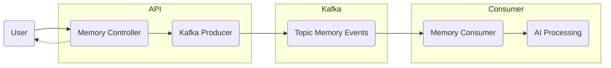

# Event-Driven Architecture (Kafka) Deep Dive

This document explains exactly how **Apache Kafka** powers the "Digital Memory Engine", enabling it to be fast, resilient, and scalable.

## 1. The Core Concept: "Fire and Forget"
In a traditional app, when you save a memory, the server would make you wait while it talks to the AI, generates embeddings, and updates the database. This is **slow** (3-5 seconds).

In our **Event-Driven** system:
1. You hit "Save".
2. We save the text and say "Done!" (200ms).
3. We queue a "Job" (Event) for the heavy lifting to happen in the background.

## 2. Kafka Architecture Diagram

## 3. How It Works (Step-by-Step)

### Step 1: The Producer (`MemoryEventProducer.java`)
When `MemoryService.createMemory()` runs:
- It creates a **Domain Event** (`MemoryCreatedEvent`).
- Payload: `{ memoryId: 101, userId: "vinayak", content: "..." }`
- It "Produces" this message to the topic `memory-events`.

### Step 2: The Topic (`memory-events`)
Think of this as a high-speed log file on the cloud (Confluent).
- **Durability**: If your server crashes right now, the event is safe in Kafka.
- **Ordering**: Events for the same memory are processed in order.

### Step 3: The Consumer (`MemoryEventConsumer.java`)
A background listener running in your Spring Boot app.
- **Group ID**: `memory-engine-group`
- **Concurrency**: We run **3 parallel consumers**. This means if you upload 300 memories at once, 3 workers will process them simultaneously.

### Step 4: Async Operations (The "Heavy Lifting")
The consumer picks up the event and executes tasks that would be too slow for an API response:
1.  **AI Vectorization**: Calls Gemini -> Gets Embedding -> Updates DB.
2.  **Intelligence**: Extracts keywords -> Updates `topics` table.
3.  **Graph Linking**: Finds related memories -> Creates relationships.

## 4. Why We Use This? (Benefits)

1.  **Zero Latency for Users**: You don't wait for the AI. You get an instant "Success" message.
2.  **Resilience**: If Gemini AI is down, the API doesn't fail. The events just sit in Kafka waiting. Once Gemini is back up, the consumers retry and catch up.
3.  **Scalability**: If your app gets popular, we can just add more "Consumer" instances to process the queue faster, without touching the API.
4.  **Decoupling**: The part of the code that *saves* a memory doesn't need to know anything about *how* embeddings work.

## 5. Key Configuration (`KafkaConfig.java`)
- **Protocol**: `SASL_SSL` (Secure connection to Confluent Cloud/AWS).
- **Serialization**: `StringSerializer` (Key), `JsonSerializer` (Value).
- **Error Handling**: 3 Retries with 1-second backoff. If it fails 3 times, we log an error (prevents infinite loops).
