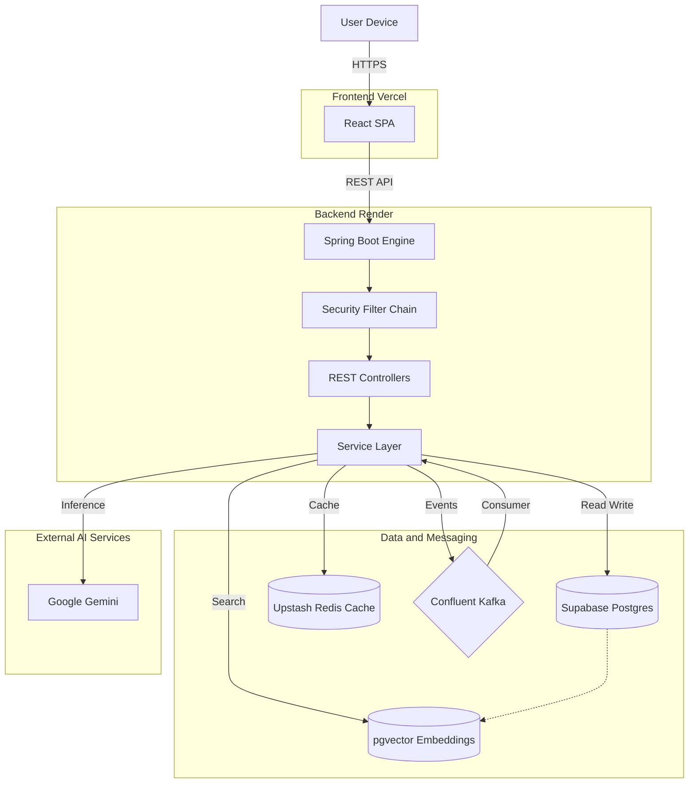
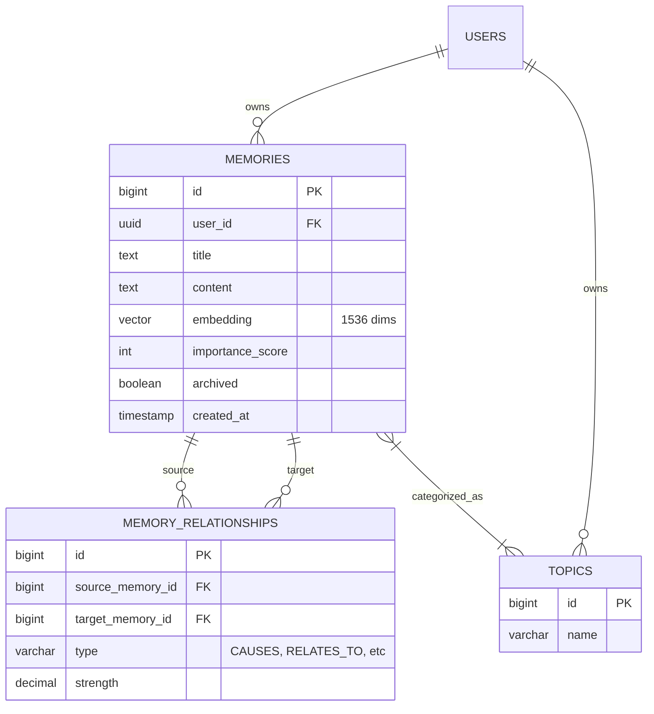
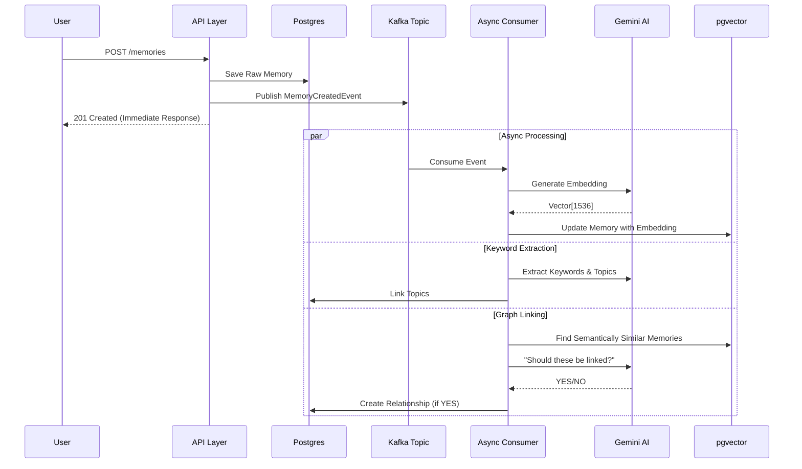
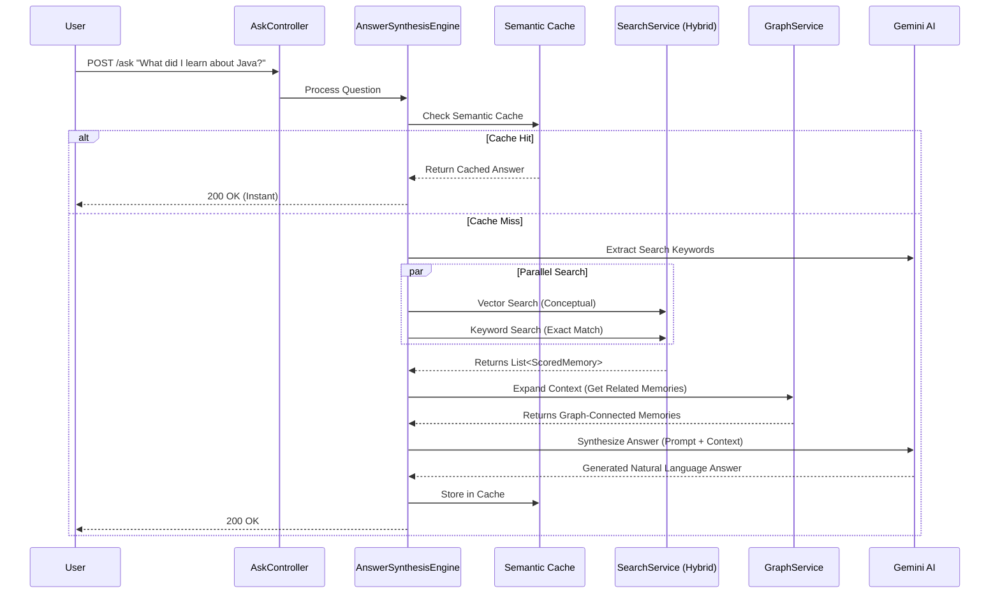
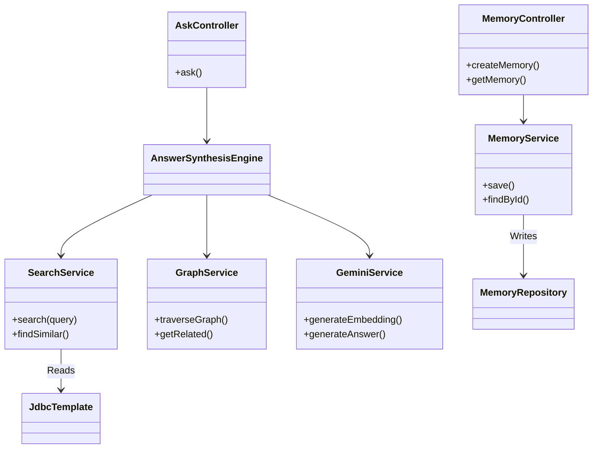

# System Architecture

## 1. High-Level Design (HLD)
This diagram illustrates the infrastructure and high-level component interaction of the Digital Memory Engine.

## 2. Entity Relationship Diagram (ERD)
The database schema designed for graph-like relationships and vector search.

## 3. Write Path (Memory Ingestion)
How data flows when a memory is created (**Event-Driven Architecture**).

## 4. Read Path (Intelligent Retrieval / RAG)
How the system answers questions (**Retrieval-Augmented Generation**).

## 5. Component Interaction (Low-Level Design - LLD)
Detailing the internal modularity.

